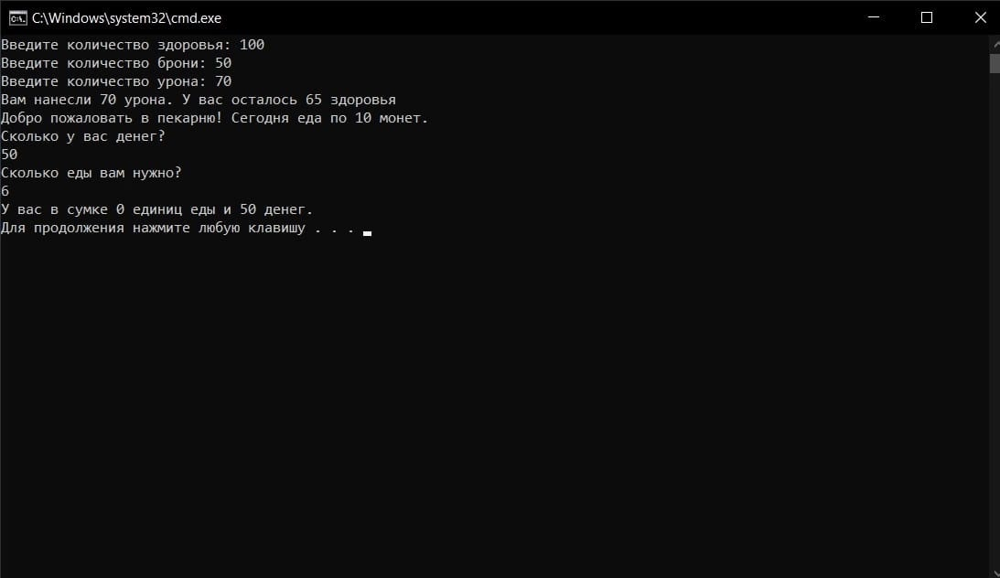

# C# Language -

- a modern object-oriented and type-safe programming language. C# allows developers to create different types of secure and reliable applications that run on .NET. C# belongs to the well-known C family of languages, and will seem familiar to anyone who has worked with C, C++, Java, or JavaScript. 

## How to install the program so that the compiler works?

1) Install visual studio community 2022 at (https://visualstudio.microsoft.com/ru/) 

2) Download unity hub, packages with .NET extension, ASP.NET and web applications

## Why I chose the C# programming language?

Because I have to study this programming language in college, and do various projects with it. 

## 5 days later (easy practical task)

# Days (What I've been doing)

## Day 1 

There are two programs in this folder: "Hello World" and what types of data are used in c#

## Day 2 

There are two programs in this folder: arithmetic and logical operations

## Day 3

This folder is an example of how concatenation works

## Day 4 

In this folder there are two programs: how to work with the console and how to convert data

## Day 5 

Practical task (a simple console game)

## Day 6

There are 3 programs in this folder: conditional switch operator, logical operators (AND OR NOT) and a simple console game

## Day 7

There are two programs in this folder: a practical assignment (a console game) and the code that we studied in college

## Day 8

There are three programs in this folder: an if else calculator; a switch calculator; and code from college

## Day 9

This folder contains the program we looked at in college (comparison operators: more, less, or equal)

## Day 10

There are two programs in this folder: cycles, which we looked at in college, and the pyramid created with cycles

## Day 11

In this folder, the program, consider in college arrays along with loops

## Day 12

Laboratory work in college

## Day 13

 In this folder is a practical assignment (console game)

## Day 14

There are two programs in this folder: we looked at arrays in college and how to fill them (with random numbers) and LINQ

## Day 15

Laboratory work in college

## Day 16

In this folder: random number generator, the game "Guess the number", Tricks of the console, Buying airline tickets

## Day 17

They were looking at the param in college

## Day 18 

Laboratory work in college

